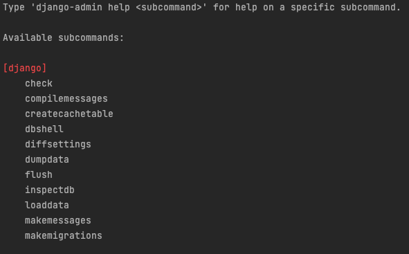
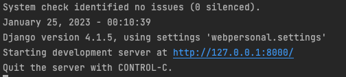

### COMANDOS PARA UN NUEVO PROYECTO

Vamos a instalar los paquetes que vamos a utilizar para este proyecto.  
`pipenv install django django-ckeditor Pillow pylint pylint-django pylint-celery`  
 
**/framework/es un editor Wysiwing para editar campos/ gestionar imagenes/para mostrar los posibles errores de codigo de las importanciones**

Veficar donde sea instalado nuestro entorno virtual `pipenv --venv`

`pipenv run django-admin` podemos ver que tenemos diferentes comandos especificos de este script  

Para crear un nuevo proyecto en django ejecutamos el siguiente comando.  
`pipenv run django-admin startproject webpersonal`  

Este comando es para inicializar el entorno virtual sobre el proyecto  
`pipenv shell`   

Para poner en marcha el proyecto usamos el siguiente comando.  
`python3 manage.py runserver`   

